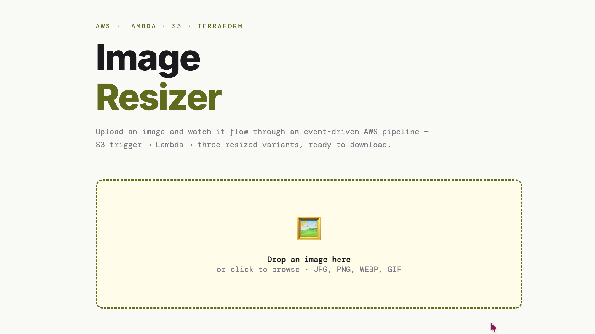

<div align="center">

```
██╗███╗   ███╗ █████╗  ██████╗ ███████╗    ██████╗ ███████╗███████╗██╗███████╗███████╗██████╗
██║████╗ ████║██╔══██╗██╔════╝ ██╔════╝    ██╔══██╗██╔════╝██╔════╝██║╚══███╔╝██╔════╝██╔══██╗
██║██╔████╔██║███████║██║  ███╗█████╗      ██████╔╝█████╗  ███████╗██║  ███╔╝ █████╗  ██████╔╝
██║██║╚██╔╝██║██╔══██║██║   ██║██╔══╝      ██╔══██╗██╔══╝  ╚════██║██║ ███╔╝  ██╔══╝  ██╔══██╗
██║██║ ╚═╝ ██║██║  ██║╚██████╔╝███████╗    ██║  ██║███████╗███████║██║███████╗███████╗██║  ██║
╚═╝╚═╝     ╚═╝╚═╝  ╚═╝ ╚═════╝ ╚══════╝    ╚═╝  ╚═╝╚══════╝╚══════╝╚═╝╚══════╝╚══════╝╚═╝  ╚═╝
```

**Event-driven image processing pipeline · Built with AWS + Terraform**


*Drop an image. Watch it flow through a serverless AWS pipeline. Get back three perfectly resized variants.*

</div>

---

<div align="center">



</div>

---

## What is this?

A fully serverless, event-driven image processing pipeline provisioned entirely with Terraform. Upload an image through the browser — the file travels directly to S3, triggers a Lambda function, gets resized into three variants (thumbnail / medium / large), and the results are served back to you. Zero servers. Zero manual AWS console clicks. Pure Infrastructure as Code.

Built to showcase real-world AWS architecture patterns: presigned URLs, S3 event triggers, Lambda layers, least-privilege IAM, and API Gateway — all reproducible with a single `terraform apply`.

> ⚠️ **Demo / learning project — not production-ready.** This is a portfolio piece to demonstrate AWS and Terraform patterns, not a hardened production service. See [Production Hardening](#production-hardening--what-youd-add-next) for what would need to change before any real-world deployment.

---

## Architecture

```
┌─────────────────────────────────────────────────────────────────────┐
│                           BROWSER                                    │
│                      frontend/index.html                             │
└────────┬──────────────────────┬──────────────────────┬──────────────┘
         │                      │                       │
    ① GET /presign         ② PUT image            ⑥ GET /results
         │                      │                       │
         ▼                      ▼                       ▼
┌─────────────────┐    ┌─────────────────┐    ┌─────────────────┐
│   API Gateway   │    │   S3 — uploads  │    │   API Gateway   │
│   HTTP API      │    │  (private)      │    │   HTTP API      │
└────────┬────────┘    └────────┬────────┘    └────────┬────────┘
         │                      │                       │
    ③ invoke              ④ S3 Event               ⑤ invoke
         │                 ObjectCreated               │
         ▼                      ▼                       ▼
┌─────────────────┐    ┌─────────────────┐    ┌─────────────────┐
│   API Lambda    │    │ Resizer Lambda  │    │   API Lambda    │
│  · presign URL  │    │  · Pillow layer │    │  · list_objects │
│  · list outputs │    │  · 3 variants   │    │  · build URLs   │
└─────────────────┘    └────────┬────────┘    └─────────────────┘
                                │
                           ⑤ write
                                │
                                ▼
                       ┌─────────────────┐
                       │  S3 — outputs   │
                       │  (private)      │
                       │  thumb.jpg      │
                       │  medium.jpg     │
                       │  large.jpg      │
                       └─────────────────┘
```

---

## The Full Flow — Step by Step

### ① Presigned URL Request

The browser never holds AWS credentials. Instead, it asks the **API Lambda** for a temporary upload ticket:

```
GET /presign?filename=photo.jpg
```

The Lambda uses its IAM role to call `s3.generate_presigned_url()` — producing a time-limited, cryptographically signed S3 URL that expires in 5 minutes. This URL encodes *exactly* what's allowed: one PUT, to one specific key, in one specific bucket. Nothing more.

> **Why this matters:** Credentials stay server-side. The browser gets a one-time permission slip, not the keys to the kingdom.

---

### ② Direct S3 Upload (Presigned PUT)

Armed with the presigned URL, the browser uploads directly to S3 — **bypassing API Gateway and Lambda entirely**:

```
PUT https://s3.eu-west-1.amazonaws.com/image-resizer-uploads-xxxx/originals/uuid-photo.jpg
```

The file travels from the browser straight to S3. This is efficient (no double-hop through Lambda), cheap (no Lambda compute for the upload), and scales to any file size.

S3 CORS is configured to allow `PUT` from any origin so the browser doesn't get blocked.

---

### ③④ S3 Event Trigger

The moment the file lands in `originals/`, S3 fires an **ObjectCreated** event directly to the Resizer Lambda — automatically, instantly, no polling:

```hcl
# terraform/s3.tf
resource "aws_s3_bucket_notification" "uploads_trigger" {
  lambda_function {
    lambda_function_arn = aws_lambda_function.resizer.arn
    events              = ["s3:ObjectCreated:*"]
    filter_prefix       = "originals/"
  }
}
```

This is the heart of event-driven architecture. No scheduler. No queue (for this scale). S3 calls Lambda the way a doorbell calls you — the moment something arrives.

The `aws_lambda_permission` resource in `iam.tf` grants S3 the right to invoke *this specific Lambda and nothing else*.

---

### ⑤ Lambda Resizes the Image

The Resizer Lambda receives the S3 event, downloads the original, and uses **Pillow** to produce three variants:

| Variant  | Max Width | Use Case              |
|----------|-----------|-----------------------|
| `thumb`  | 150px     | Thumbnails, avatars   |
| `medium` | 600px     | Blog posts, previews  |
| `large`  | 1200px    | Full-width display    |

Aspect ratio is always preserved. Images are never upscaled. Output is JPEG with quality 85 and `optimize=True` for efficient file sizes. Pillow isn't bundled with the Lambda — it's delivered via a **[Klayers](https://github.com/keithrozario/Klayers) Lambda Layer** by [Keith Rozario](https://github.com/keithrozario), keeping the deployment package tiny.

Outputs land at:
```
s3://image-resizer-outputs-xxxx/resized/{uuid}-photo/thumb.jpg
s3://image-resizer-outputs-xxxx/resized/{uuid}-photo/medium.jpg
s3://image-resizer-outputs-xxxx/resized/{uuid}-photo/large.jpg
```

---

### ⑥ Polling for Results

Lambda is asynchronous — the browser doesn't know when it finishes. So every 2 seconds the frontend calls:

```
GET /results?key=originals/uuid-photo.jpg
```

The API Lambda calls `s3.list_objects_v2()` with the expected output prefix. Empty response → `{"status": "processing"}`. Three objects found → returns **presigned GET URLs** (valid for 1 hour) so the browser can fetch the private objects. The browser renders the image cards.

---

## AWS Services

| Service | Role | Config |
|---|---|---|
| **S3** (uploads) | Receives originals via presigned PUT | Private, 1-day lifecycle |
| **S3** (outputs) | Serves resized variants via presigned URLs | Private, 7-day lifecycle |
| **Lambda** (resizer) | Pillow resize, S3-triggered | 512MB, 30s timeout, Python 3.12 |
| **Lambda** (api) | Presign + results endpoints | 128MB, 10s timeout |
| **API Gateway** (HTTP) | Public HTTPS front door | CORS, `/presign`, `/results` routes |
| **IAM** | Execution roles + policies | Least-privilege per Lambda |
| **CloudWatch Logs** | Lambda observability | 7-day retention |

---

## myApplications (single-pane view)

Every resource above is registered as one application in the AWS **myApplications** console (AWS Service Catalog AppRegistry), giving a single dashboard for the pipeline's cost, CloudWatch metrics, and security findings.
This is defined in `appregistry.tf`: it creates the application and exposes its `awsApplication` tag as `local.app_tags`, which is merged into each billable resource's `tags` block (both buckets, both Lambdas, the HTTP API).
Associating resources through the Terraform config, rather than tagging them out of band, keeps the grouping drift-free: a later `terraform apply` never strips the tag.
The application, its Resource Group, and the dashboard are free; only the Security Hub widget would incur cost, and it is not enabled.

---

## Terraform Structure

Terraform is the single source of truth for every AWS resource. Run `terraform destroy` and it all disappears. Run `terraform apply` again and it's all back — identical.

```
terraform/
├── main.tf          → Provider config, random suffix for unique bucket names
├── variables.tf     → All configurable values (region, sizes, memory, timeout)
├── outputs.tf       → Prints api_base_url after deploy
├── s3.tf            → Both buckets, CORS, lifecycle rules, S3→Lambda notification
├── lambda.tf        → Both Lambdas, Pillow layer ARN map, CloudWatch log group
├── iam.tf           → Execution roles, S3 policies, S3 invoke permission
├── api_gateway.tf   → HTTP API, routes, Lambda integration, API Lambda code
└── appregistry.tf   → myApplications grouping (AppRegistry app + resource tags)
```

Terraform builds a **dependency graph** from resource references. For example:

```hcl
resource "aws_iam_role_policy" "lambda_s3" {
  role     = aws_iam_role.lambda_exec.id        # must exist first
  Resource = "${aws_s3_bucket.uploads.arn}/*"   # must exist first
}
```

It reads these references and automatically determines creation order. You never specify it manually.

---

## Security Model

### IAM — Least Privilege

Each Lambda has its own role scoped to the minimum required permissions:

**Resizer Lambda**
```
s3:GetObject    → uploads bucket only
s3:PutObject    → outputs bucket only
logs:*          → its own CloudWatch log group only
```

**API Lambda**
```
s3:PutObject    → uploads/originals/* only (for upload presigning)
s3:ListBucket   → outputs bucket, resized/* prefix only (for polling)
s3:GetObject    → outputs/resized/* only (for download presigning)
logs:*          → its own CloudWatch log group only
```

Neither Lambda can delete files. Neither can access the other's primary bucket in reverse. No wildcard `*` actions anywhere.

### What's Safe for a Demo

- ✅ Credentials never leave the server side
- ✅ **Both** S3 buckets are fully private — nothing is publicly accessible
- ✅ Resized images are served via short-lived presigned GET URLs (1-hour expiry)
- ✅ Files auto-expire (1 day uploads, 7 days outputs)
- ✅ No secrets hardcoded anywhere in the codebase
- ✅ Compatible with accounts that enforce S3 Block Public Access at the account level

---

## Production Hardening — What You'd Add Next

This project is intentionally scoped as a portfolio demo. Here's what a production version would add:

### Security
- **Lock down CORS** — replace `allow_origins = ["*"]` with your actual domain
- **API authentication** — add an API key or AWS Cognito authorizer to API Gateway
- **File type validation** — check magic bytes (file signature) in Lambda, not just Content-Type
- **Upload size cap** — enforce max file size via S3 bucket policy conditions
- **KMS encryption** — add `aws_kms_key` and enable SSE-KMS on both S3 buckets
- **AWS WAF** — attach a Web ACL to API Gateway to block abuse and rate-limit requests
- **Shorten presigned URL TTL** — currently 1 hour for downloads; tighten based on UX needs

### Performance & Reliability
- **CloudFront** — put a CDN in front of the output bucket instead of direct S3 URLs; faster globally, plus you can invalidate files
- **SQS queue** — for high volume, decouple S3 events through SQS → Lambda for better retry handling and backpressure
- **Dead letter queue (DLQ)** — catch failed Lambda invocations and alert on them

### Observability
- **CloudWatch Alarms** — alert on Lambda errors, throttles, or duration spikes
- **X-Ray tracing** — end-to-end distributed tracing across API Gateway and both Lambdas
- **S3 access logs** — audit who accessed which files and when

### Infrastructure
- **Terraform remote state** — store `terraform.tfstate` in S3 + DynamoDB locking instead of locally
- **Terraform workspaces** — separate `dev` / `staging` / `prod` environments from one codebase
- **GitHub Actions CI** — run `terraform plan` on every PR, `terraform apply` on merge to main

---

## Deploy

### Prerequisites

- [Terraform](https://developer.hashicorp.com/terraform/install) ≥ 1.5
- AWS credentials configured (see note on temporary credentials below)

### With permanent credentials

```bash
aws configure
```

### With temporary credentials (STS / SSO / assumed role)

```bash
export AWS_ACCESS_KEY_ID="ASIA..."
export AWS_SECRET_ACCESS_KEY="your-secret..."
export AWS_SESSION_TOKEN="your-session-token..."
export AWS_DEFAULT_REGION="eu-west-1"
```

> Temporary credentials expire (typically 1–4 hours). Re-export before running Terraform if they've lapsed.

### Run

```bash
cd terraform

terraform init      # download providers
terraform plan      # preview what will be created
terraform apply     # create everything (~60 seconds)
```

Copy the `api_base_url` from the output and paste it (without trailing slash) into the `API_BASE_URL` constant in `frontend/index.html`.

### Run the frontend

The HTML must be served over HTTP — opening it as `file://` will be blocked by Chrome's CORS policy. From the project root:

```bash
cd frontend
python3 -m http.server 8080
```

Then open **http://localhost:8080** in your browser.

### Tear down

```bash
terraform destroy
```

Buckets use `force_destroy = true` — they'll be emptied and deleted automatically.

---

## Changing Region

The Pillow layer ARN is **fetched dynamically at plan time** from the [Klayers API](https://api.klayers.cloud) ([Keith Rozario's Klayers project](https://github.com/keithrozario/Klayers)), so the project works in any region where Klayers publishes a Python 3.12 Pillow layer — without hardcoding ARNs.

Just change `aws_region` in `terraform/variables.tf` (or pass `-var aws_region=...` to `terraform apply`) and Terraform resolves the latest valid layer automatically.

If you target a region Klayers doesn't cover, you'll need to publish your own Pillow layer there.

---

## Project Structure

```
image-resizer/
├── terraform/
│   ├── main.tf
│   ├── variables.tf
│   ├── outputs.tf
│   ├── s3.tf
│   ├── lambda.tf
│   ├── iam.tf
│   ├── api_gateway.tf
│   └── appregistry.tf
├── lambda/
│   ├── handler.py          ← Resizer (Pillow)
│   └── requirements.txt    ← Local dev reference
├── frontend/
│   └── index.html          ← Single-file UI, no build step
└── README.md
```

---

## Credits

- **[Klayers](https://github.com/keithrozario/Klayers)** by [Keith Rozario](https://github.com/keithrozario) — community-maintained AWS Lambda layers. The Pillow layer used by the resizer Lambda is fetched from the Klayers API at Terraform plan time, avoiding the need to bundle Pillow manually.

---

<div align="center">

Built by [Pantelis Tsagkas](https://github.com/PantelisTsagkas) · AWS · Terraform · Python · IaC

*Every resource in this repo was provisioned with code. Zero console clicks.*

</div>
